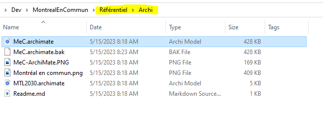
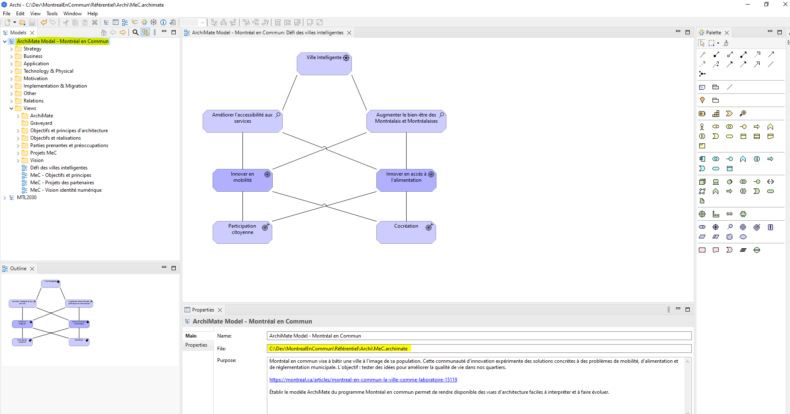
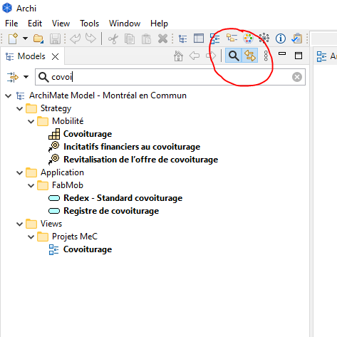
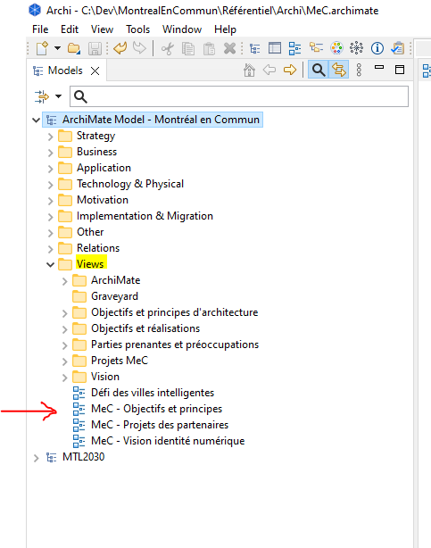
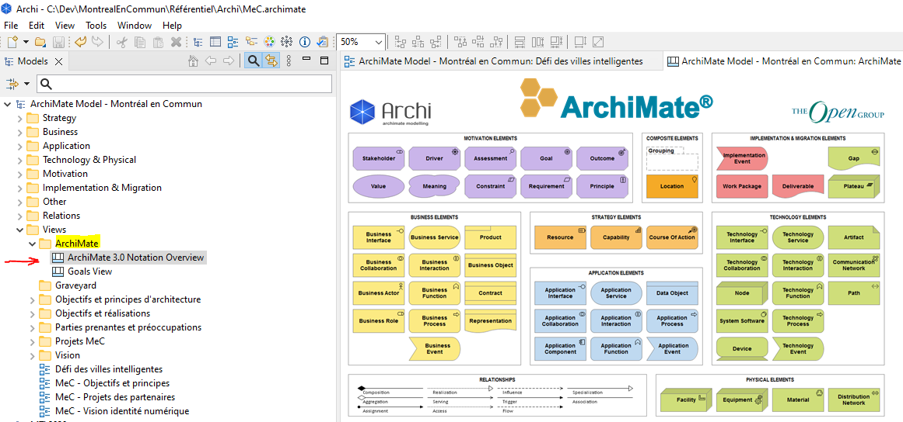

# Modification du modèle du programme MeC
Pour faire des modifications au modèle, il est nécessaire de faire les deux étapes suivantes:
- Ouvrir et modifier le fichier du modèle en utilisant l'outil Archi
- Générer les pages web du modèle

La première étape est d'installer et se familiariser avec l'application [Archi](https://www.archimatetool.com/). 
Cette application est un logiciel libre qui permet de créer et modifier des modèles d'architecture en utilisant le langage de modélisation ArchiMate. 
Veuillez-vous référer au [guide d'utilisation](https://www.archimatetool.com/downloads/archi/Archi%20User%20Guide.pdf) pour une introduction rapide de cet outil.

## Modification du modèle ArchiMate
Suivre les étapes suivantes Pour modifier le modèle ArchiMate du programme MeC:
1. Créer une branche de modification dans votre repo local
2. Naviguer vers l'emplacement du fichier MeC.archimate et ouvrir le fichier avec l'outil Archi  

3. Utiliser l'arbre de navigation pour trouver les vues et composants à modifier  

4. L'outil permet de faire la recherche par mot clé  

5. Il est plus facile de lire le modèle en commençant par les vues holistiques  

7. Une vue de référence a été ajouté pour servir comme un aide-mémoire  

## Génération des GitHub Pages du modèle
[GitHub Pages](https://docs.github.com/fr/pages/getting-started-with-github-pages/about-github-pages)
