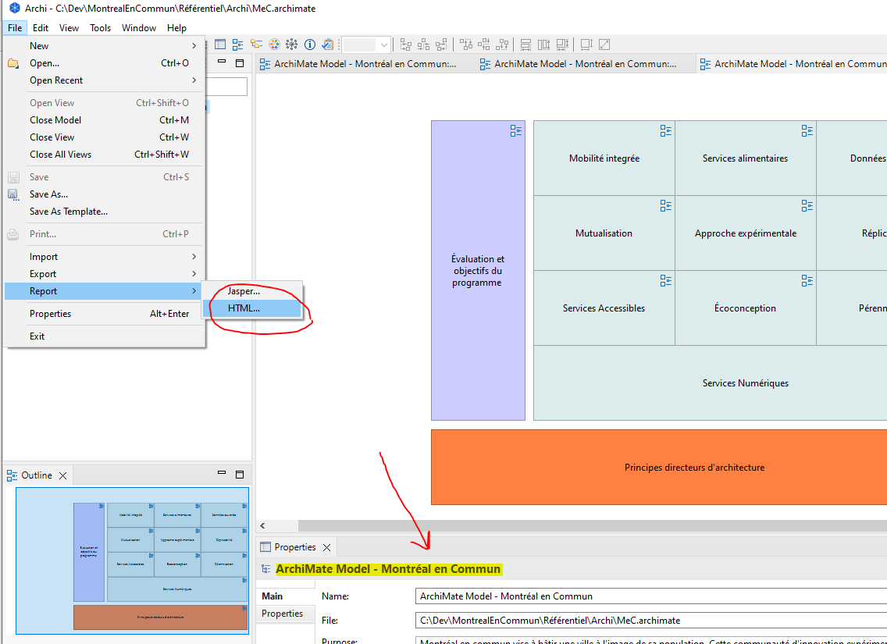
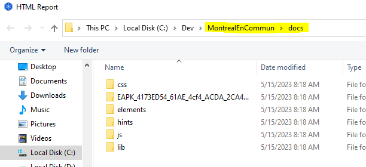

# Modification du modèle du programme MeC
Pour faire des modifications au modèle, il est nécessaire de faire les deux étapes suivantes:
- Ouvrir et modifier le fichier du modèle en utilisant l'outil Archi
- Générer les pages web du modèle

La première étape est d'installer et se familiariser avec l'application [Archi](https://www.archimatetool.com/). 
Cette application est un logiciel libre qui permet de créer et modifier des modèles d'architecture en utilisant le langage de modélisation ArchiMate. 
Veuillez-vous référer au [guide d'utilisation](https://www.archimatetool.com/downloads/archi/Archi%20User%20Guide.pdf) pour une introduction rapide de cet outil.

## Modification du modèle ArchiMate
Suivre les étapes suivantes Pour modifier le modèle ArchiMate du programme MeC:
1. Créer une branche de modification dans votre repo local
2. Naviguer vers l'emplacement du fichier MeC.archimate et ouvrir le fichier avec l'outil Archi  

3. Utiliser l'arbre de navigation pour trouver les vues et composants à modifier  

4. L'outil permet de faire la recherche par mot clé  

5. Il est plus facile de lire le modèle en commençant par les vues holistiques  

7. Une vue de référence a été ajouté pour servir comme un aide-mémoire  

8. Faire les modifications requises et passer à l'étape suivante pour générer les pages web du modèle ArchiMate du programme MeC.  

## Génération des GitHub Pages du modèle

Pour publier une , on devrait commencer par la création des pages web dans l'outil Archi même. Puis, ajouter les pages générées au repo du programme. Ces pages vont par la suite être utilisées comme la root du site web basé sur les 
[GitHub Pages](https://docs.github.com/fr/pages/getting-started-with-github-pages/about-github-pages).  
Suivre les étapes suivantes pour compléter ce travail:  
1. Dans l'application Archi, s'assurer que le modèle du programme est selectionné et choisir le rapport HTML du menu  

2. Le repo du programme est déjà configuré pour utiliser le répertoire */docs*  

3. Choisir le répértoire */docs* comme destination pour mettre à jour le bon répertoire du repo  

4. Vérifier les pages générées et pousser les modifications à votre repo local. Puis, si le tout est à votre goût. créer un demande de tirage (Pull Request) au repo VMTL du programme MeC. 

